### Requirements for the backend
- Java JDK 17
- Apache Maven

### How to run the backend project locally via Terminal
- Open the Terminal in the todolist root directory where pom.xml is located
- Install libraries and build by running this command: mvn clean compile
- Run the app with local profile: mvn spring-boot:run "-Dspring-boot.run.profiles=local"
- The backend is accessible via: http://localhost:8082/
- The H2 database is accessible in the browser via: http://localhost:8082/h2-console. The JDBC URL is jdbc:h2:file:./data/todolist;MODE=PostgreSQL;DB_CLOSE_DELAY=-1. Username is: sa. No password. Click the Connect button to access the database.
- Run the test by using this command: mvn test

### Backend approach and features
- I first designed the database by structuring the database. I need two tables, one for User and one for Todo.

        - Users table should have three columns: auto increment primary key ID, a user_name, and a hash column to store hashed password value.
        - Todolist table should have six columns: auto increment primary key ID, task_name for the name of the todo, task_description for the todo description, owner_id stores the ID of the user who creates the todo, task_date stores the due date of the todo, task_order stores the numeric value which is used for displaying the todo list.
- For the logic of the backend, we have two Service classes, one for Users and one for Todos. For user, created empty methods for register and login. For Todo, I created empty methods for create, get, update, delete, re-order todos.
- Created Mockito unit tests for the Services. Implemented the services until the test passed.
- Created Controllers for Users and Todos. Routes of User Controller are /register, /getUserName, /login, /update. Routes for Todos are /addTodolist, /getTodoList, /moveTodolist, /deleteTodo, /updateTodo.
- Created Mockito unit tests for Controller. Implemented the controllers until the test passed.
- For password storing, I used BCrypt to hash the password when registering, and compare hash when logging in.
- Except for /login and /register routes, every requests made toward the backend requires Authorization, and I used Bearer Token for this. Spring security is used for generating the token; the token is stored in a hashmap with the key is the token and its value is the user Id. This Bearer token would be stored in SessionStorage of the frontend application.

### What could be improved in the backend
- For backend feature, I would like to add a third column in the database for table Todolist and call it task_status. This would be used to track the status of the todo and its values are Not Started, In Progress, and Complete. This can be added in the current /updateTodo route. I expect this can take another day to complete
- Improve the performance by changing the move to do logic. Their stored order could be starting from 0, 1000, 2000,... instead of 0, 1, 2...
- The Bearer token is saved in a Map, I would like to revoke the token. If I do this, user would need to re-login to generate a new token. I could take a look at signed JWT.
- For better documentation, I would like to add Swagger UI to make it easier to see the APIs.

### Test coverage for the backend
- To run the test, run the command: mvn test. The output can be accessed in /target/site/jacoco/index.html

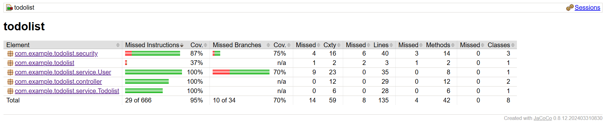
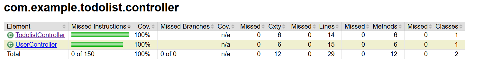
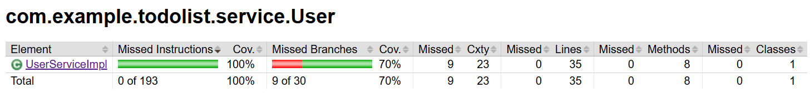
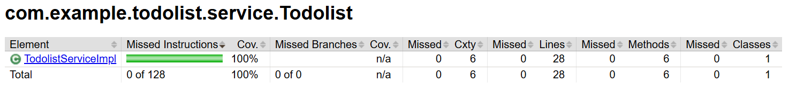

### Requirements for the frontend
- Node version 22

### How to run the frontend project locally
- Open the Terminal in the todolist-fe directory where package.json is located.
- Install the libraries, run the command: npm install
- After the libraries are installed successfully, run the command: npm start
- After the app is compiled, it can be access in the web browser at: http://localhost:3000/

### Frontend approach and features
- I first listed out what pages would be required, we need a Login/Register page, a Dashboard page, and a Profile. Each page would be a parent component and will have small components.
- As the userId is used in multiple backend API calls, I would like it to be accessible in the entire application, after the value is stored in SessionStorage, I used Redux to pass it down to multiple components.
- There are 3 routes in the frontend: /login, /dashboard, /profile. If auth entry is not found in SessionStorage, the app redirects the user to /login page.
- Once the user login, the app displays Dashboard component. This component should have an Add button which is used to create todo items. Each created todo item is a TodoComponent, and is mapped to a list.
- Clicking the Add Todo button takes the user to the AddTodo Component. Here the user can enter Todo name, description, and due date. The user need to input name and due date to enable the Create todo button, description is optional. Clicking Cancel returns to the Dashboard
- The AddComponent is re-used as Update Todo: if the user clicks a todo in the Dashboard list, the parent DashboardComponent passes the clicked todo object to its child AddTodoComponent, we display it as Update Todo. While it is in update state, the Delete Todo button is also visible. If the user decided to delete a todo, there is a confirmation box display to warn user from accidentally delete. The user can also update the todo item.
- When the user access /dashboard, DashboardComponent loads todo list based on the user id. The user can also search for a specific todo based on name or description. This will filter the loaded todo list.
- The user can reorder by interacting with the handle bar, once released, the app updates the order of the todo list. The handle is hidden if there text in the search box is active to avoid the user from modify the order while search.
- In case the list of todo gets to big, I added PaginationComponent, each page is limited to 7 items. This component is only visible when item is more than 7.
- The user can also change their username and password by accessing /profile route.
- Create Jest unit test before working a Component, and modify the Components' functions until the tests pass.

### What could be improved in the frontend
- If I can have more time, I would like to display status of todo. In the Dashboard, we can have three tabs: Not Started, In Progress, and Complete. As clicking a todo allows the user to update, we can have a dropdown that let the user change the status of the current todo. This feature can take me one day to complete.
- I added Pagination component which shows up when there are more than 7 items in the list. Due to this, re-order functionality can only be done within the viewed page. I would like to the ability to drag the item to next/previous pages. I expect this feature could take 3 days.
- I would like to handle the token expiry which should also be done on the backend side; and if the token expires, it should logout and notify the user

### Test coverage for the frontend
- To run the frontend tests with coverage, run the command: npx react-scripts test --coverage --watchAll=false. The output can be accessed in /coverage/lcov-report/index.html
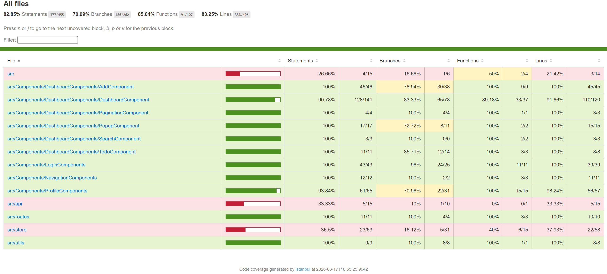

# Web Application Deployment to Azure Portal Instruction
### Requirements:
- Microsoft Visual Studio Code

### Instruction:
- In portal.azure.com, we create 2 web app services, one for the frontend, and one for the backend
- Here is the backend configuration:
  
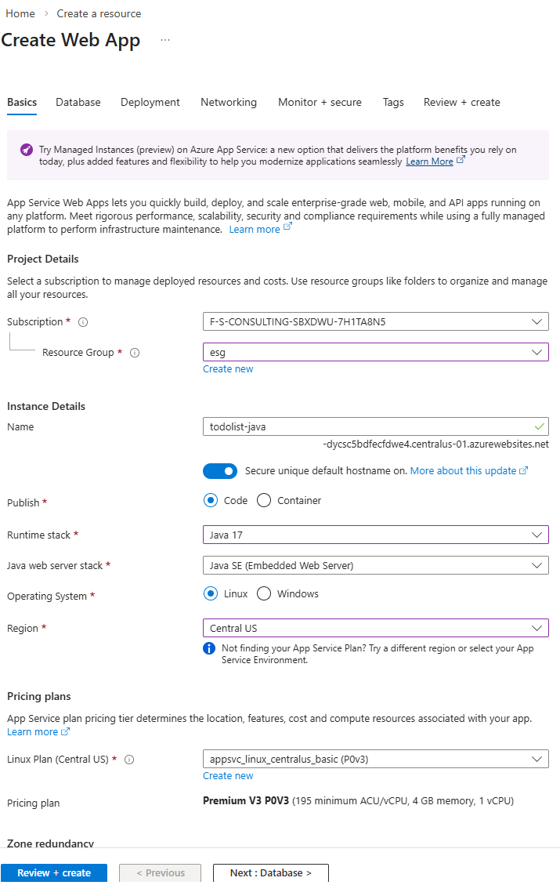
- Here is the frontend configuration:
  
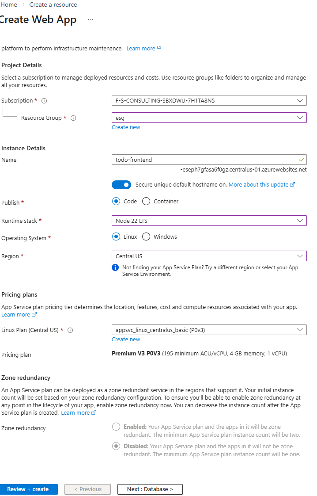
- After the services are created, we should get two web app URLs for each. Copy the frontend URL, open application.properties located in src/main/resources, set the app.cors.allowed-origin as the Azure Web Service frontend URL.
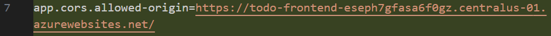
- For the frontend, in the root directory of the app, create an .env.production file, and set the REACT_APP_API_BASE_URL as the URL of the Azure Web Service backend.
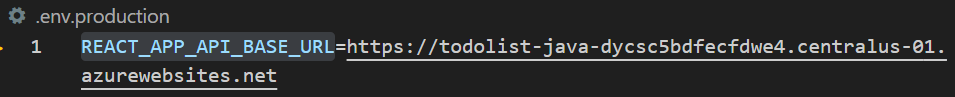.
- In Azure Portal, navigate to Settings/Configuration/StackSettings to add run config. For backend, use the command: java -jar /home/site/wwwroot/app.jar. For frontend, use the command: pm2 serve /home/site/wwwroot/build --no-daemon --spa --port 8080
- We can build the backend by using the command: mvn clean package -DskipTests. For the frontend, use the command: npm run build.
- Install and open Visual Studio Code, install the Azure extension from the Marketplace, and login to Microsoft account. Azure extension displays all the available web services. Locate our newly created frontend and backend web services.
- For backend, right click the backend service, select Deploy to Web App... The extension will ask to select the built .jar file, the file is located in: /target/todolist-0.0.1-SNAPSHOT.jar. Azure extension also asks to enter port number, we are using 8082.
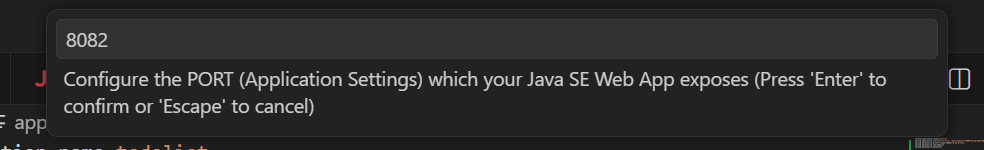
- For frontend, right click the frontend service, select Deploy to Web App... The extension will ask to select the build folder, which is located in the root folder of the frontend project.
- If successfully deployed, the application can be accessed in the browser:
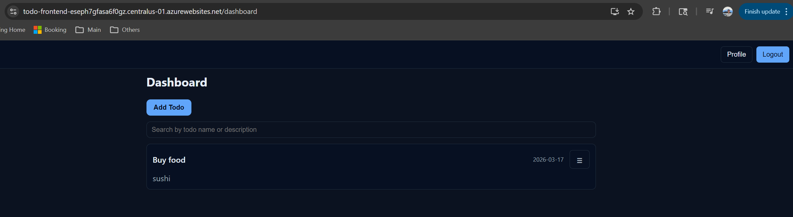

- Deployed backend URL, can be tested with Postman and Insomnia: https://todolist-java-dycsc5bdfecfdwe4.centralus-01.azurewebsites.net/
- Deployed frontend URL, can be accessed in the browser: https://todo-frontend-eseph7gfasa6f0gz.centralus-01.azurewebsites.net/
